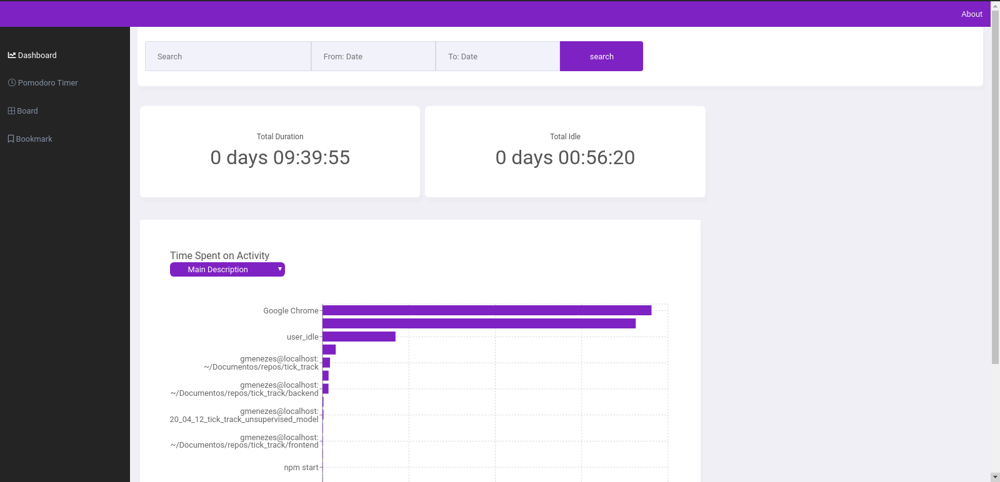

# Tick Track

Nothing but a time time tracker, to understand where you spend your ticks every day, because every tick counts.

## Description

This project is my initial step as a full stack developer. It all started a ong time ago in a distant galax, now you can imagine the opening song of Star Wars and come back to reality, because in fact it started when I didn't rembember what I had done in the previous sprint to fill the activities on my board.

## Requirements

- python >= 3.6
- pipenv
- docker
- docker-compose

## Stack

- API: Sanic
- ORM: Peewee
- Front-end: ReactJs

## Usage

### Instalation

#### pipenv

```sh
pip3 install pipenv
```

#### Python requirements

```make
make install-py
```

### Runing the server

#### Apply database's migrations

```make
make migrate
```

#### Run produtction app
```make
make run-prod
```

#### Run development app
```make
make run-dev
```

## Not Implemented yet
- Idle user time for windows and macOs
- Pomodoro Timer
- Board
- Bookmark (or markdown notes)

## Images

